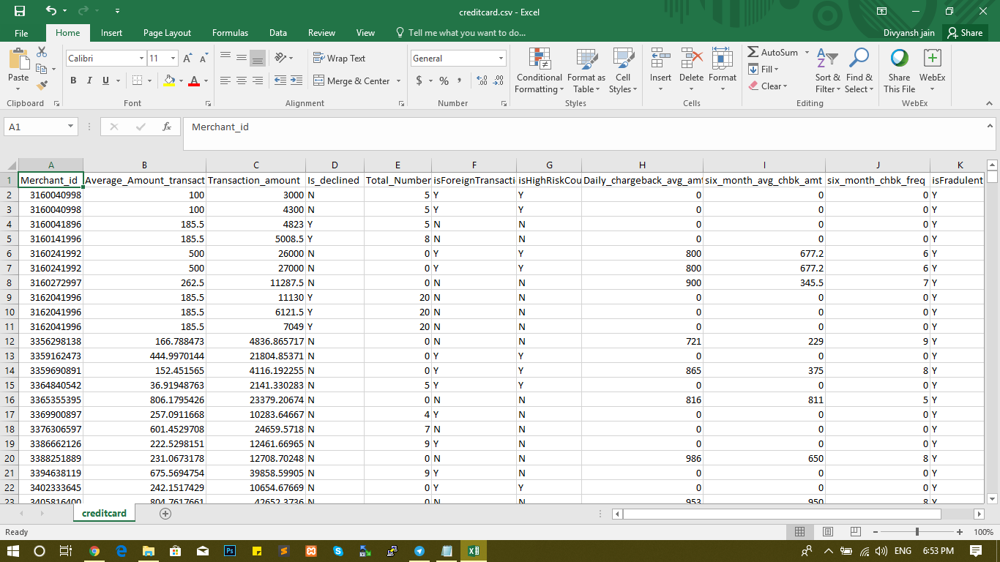
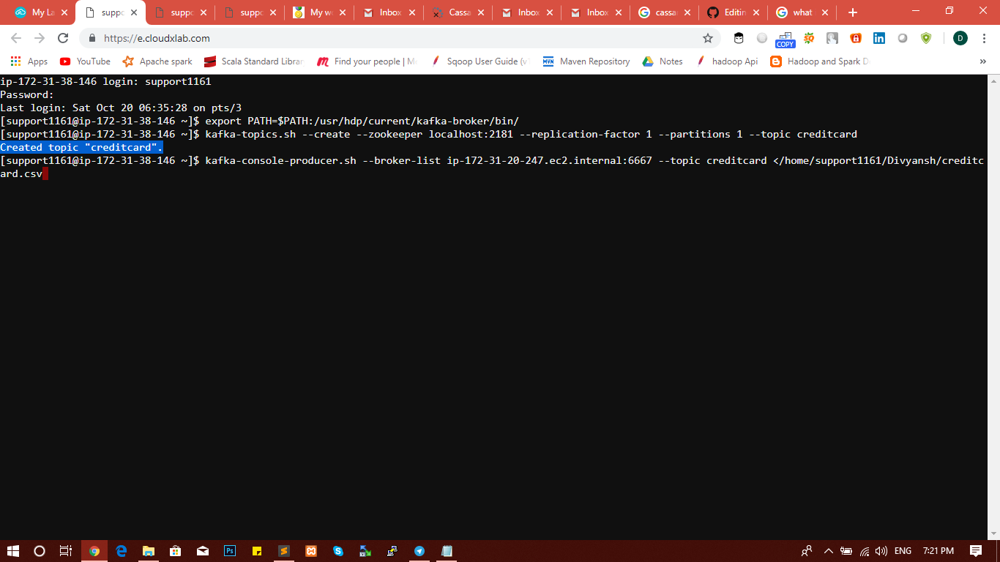
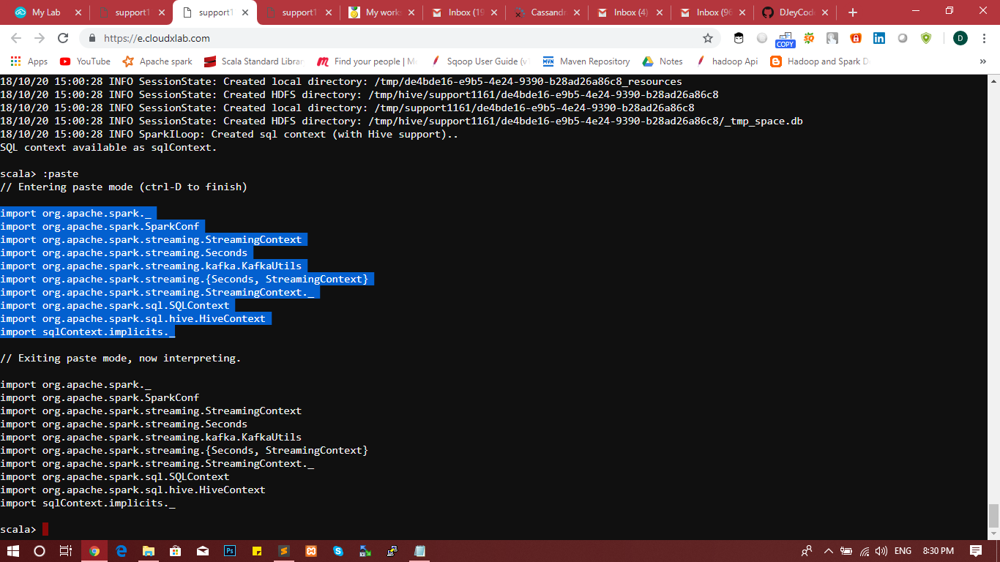
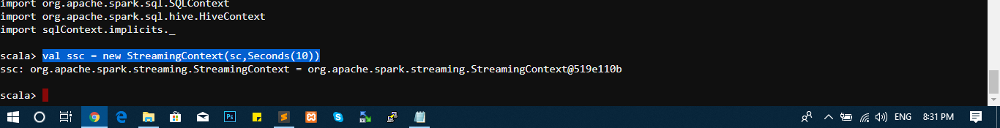
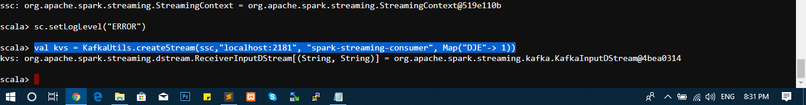
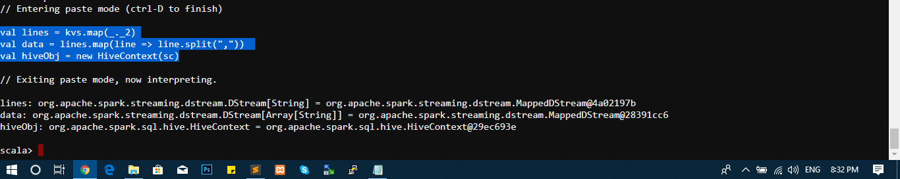
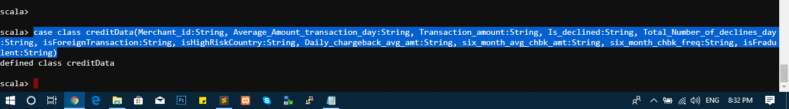
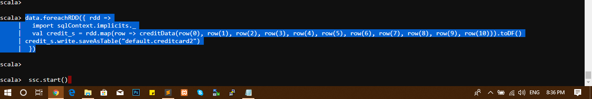
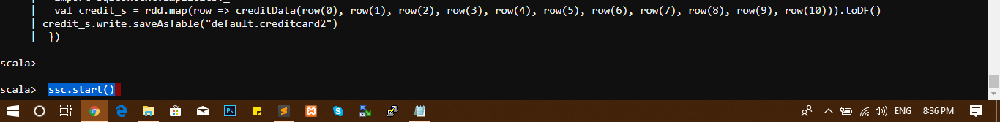

# Credit-Card-Fraud-Detection
Reading data from Kafka followed by loading/reading via Spark Streaming &amp; finally storing it in Hive Tables
****************************************************************************************

## Objective

To detect all the Credit Card Fraud been going on by analysing all the foreign & declined transactions

## Data Description

Dataset contains csv files consists of many column of credit card data.

## Tools & Technologies

Best suited technologies:
 
 1. Kafka

 2. Spark Streaming

 4. Apache Hive

## Programming Language

 1. Scala  

## Cloudxlab Details

** WebConsole Login Credentials **

Username: support1161

Password : **********

----------------------------------------------------------------------------------------------------------------------------------------------
----------------------------------------------------------------------------------------------------------------------------------------------

## Kafka Connection  

//Console 1 - Open 1st shell & do the following:

1. Export the below command to move in the directory where the Kakfa is installed:

export PATH=$PATH:/usr/hdp/current/kafka-broker/bin/ 

2. Create Topic to which messages or dataset will be stored:

		kafka-topics.sh --create --zookeeper localhost:2181 --replication-factor 1 --partitions 1 --topic DJE 

3. Now create a Consumer & pass the message/dataset to Spark by referring above created Topic i.e DJE using below command:

		kafka-console-producer.sh --broker-list ip-172-31-20-247.ec2.internal:6667 --topic DJE </home/support1161/Divyansh/creditcard.csv   

// Don't run the above command by hitting enter. This command needs to be run once completed with the Spark Code.

----------------------------------------------------------

## Spark Streaming

With the below code we will read the data sent by Kafka Consumer & Spark will act as a Producer for Topic -> creditcard

// Console 2 - Open 2nd shell & run the below code. Don't do that in first shell itself. As Kafka commands are already written in first shell

// Start Spark Shell using below command & before that download spark-streaming-kafka-assembly_2.10-1.6.0.jar.

	spark-shell --master local[2] --conf "spark.dynamicAllocation.enabled=false" --jars /home/support1161/spark-streaming-kafka-assembly_2.10-1.6.0.jar
	
// For complete code refer creditcard.scala

1. Import packages
**************

2. Create Streaming Context
**************

3. Create Stream with KafkaUtils to connect Kafka with Spark
**************

4. Split lines with comma and create HiveObject for connection with Hive
**************

5. Define the Schema of dataset to create dataframe
**************

6. Create RDD, covert it into DataFrame & Store it into Hive Table
**************

7. Start Streaming
***************

		ssc.start()

// After typing ssc.start() when hits enter, now we need to start the consumer which we have already created in kafka 
**********

----------------------------------------------------------

## Hive Shell

Console 3 - Open 3rd Shell & start with Hive

1. Use Default database & run show Tables comm

		Show tables;

2. Search for the table name & if found run Select query on the Table to check the data.

		Select * from creditcard;

3. Run the below queries to analyse the Fraud via below Problem Statement

Problem Statement 1: Select all the Merchant_id from dataset which are found to be fraud
**************

Problem Statement 2: Select all the Merchant_id whose transactions are declined
**************

Problem Statement 3: Find the total transactional amount based on merchant id
**************

Problem Statement 4: Find the total six month average amount based on each merchant id which are found to be fraud
**************

Problem Statement 5: Based on each merchant id find the total average amount per day which are declined by the bank
**************

## Hence concluded with Fraud detection  
